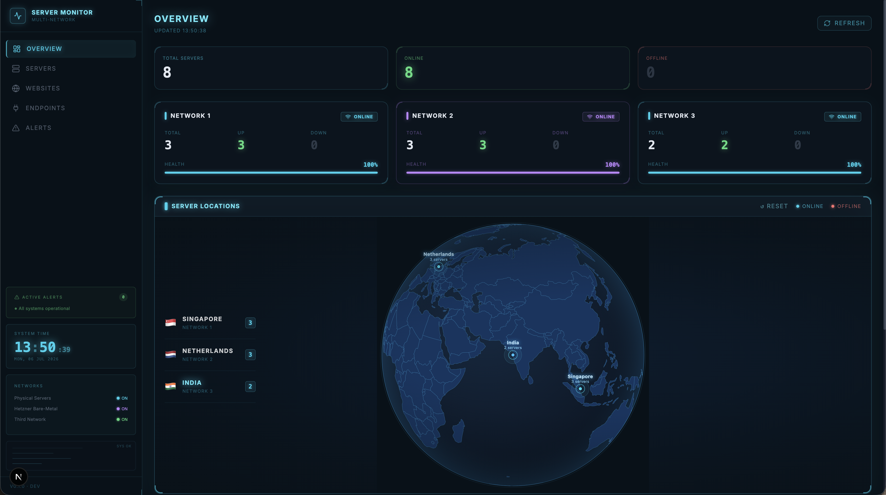
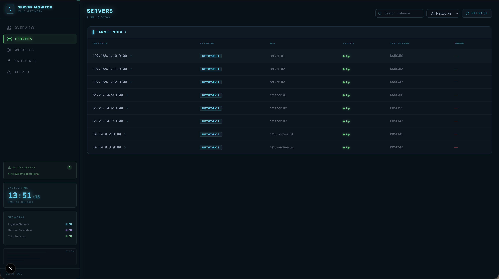
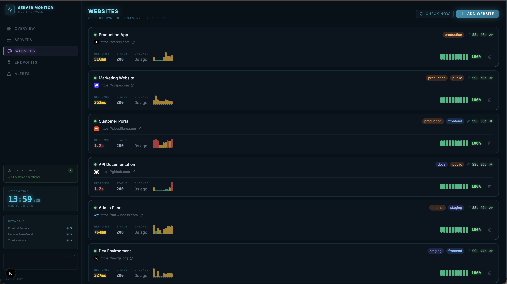
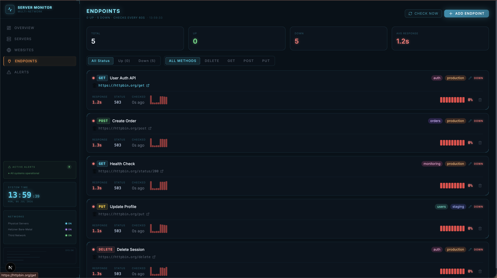

# Server Monitoring Dashboard

A centralized infrastructure monitoring dashboard built with Next.js. Connects to multiple private networks simultaneously, collects real-time server health metrics, and monitors website and API endpoint uptime — all in one place.

---

## Architecture

```
┌─────────────────────────────────────────────────────────┐
│                  Next.js Dashboard                      │
│              (Central Hub — port 3000)                  │
└────────────┬───────────────┬───────────────┬────────────┘
             │               │               │
             ▼               ▼               ▼
     ┌───────────┐   ┌───────────┐   ┌───────────┐
     │Prometheus │   │Prometheus │   │Prometheus │
     │ Network 1 │   │ Network 2 │   │ Network 3 │
     │(Physical) │   │ (Hetzner) │   │ (Custom)  │
     └─────┬─────┘   └─────┬─────┘   └─────┬─────┘
           │               │               │
     node_exporter   node_exporter   node_exporter
     on each server  on each server  on each server
```

**Hub-and-spoke model:** Each private network runs its own Prometheus instance that scrapes `node_exporter` agents on every server. The central Next.js dashboard queries all three Prometheus instances in parallel and merges the results.

If one network goes offline, the other two keep working — the system uses `Promise.allSettled()` so a single network failure never crashes the whole dashboard.

---

## Features

- **Server Monitoring** — CPU, memory, disk, load averages, uptime, network I/O per server
- **Multi-network** — monitor servers across 3 separate private networks from one dashboard
- **Website Uptime** — HTTP checks every 60 seconds with SSL certificate expiry tracking
- **API Endpoint Monitoring** — supports any HTTP method, custom headers, and request bodies
- **Check History** — response time sparklines and uptime bars for the last 20 checks
- **Fault tolerant** — one unreachable network never blocks the rest of the data

---

## Tech Stack

| Layer | Technology |
|---|---|
| Frontend | Next.js 15, TypeScript, Tailwind CSS |
| Metrics | Prometheus + node_exporter |
| Database | PostgreSQL via Prisma ORM |
| Local Dev | Docker Compose |
| HTTP Client | Axios (Prometheus), fetch (uptime checks) |

---

## Pages

| Page | Description |
|---|---|
| `/overview` | Summary cards per network + full targets table |
| `/servers` | All servers across all networks, searchable and filterable |
| `/servers/detail` | Deep-dive for one server — CPU, memory, disk, per-core breakdown |
| `/websites` | Website uptime monitoring with SSL expiry badges |
| `/endpoints` | API endpoint monitoring with method badges and filters |

---

## Screenshots

### Overview
Real-time summary across all 3 networks — total servers, online/offline counts, per-network health cards, and an interactive globe showing server locations.



### Servers
Full list of all servers across every network. Search by instance name, filter by network, and click any server to open its detail page.



### Website Monitoring
HTTP uptime checks every 60 seconds. Each card shows current status, SSL certificate expiry, response time, sparkline history, and uptime percentage.



### API Endpoint Monitoring
Monitor any API endpoint with any HTTP method (GET, POST, PUT, DELETE). Supports custom headers and request bodies. Filter by status or method.



---

## Documentation

| Guide | Description |
|---|---|
| [SETUP.md](SETUP.md) | Full production setup — install node_exporter, Prometheus, Nginx, and deploy the dashboard |
| [System_Documentation.md](System_Documentation.md) | Architecture, API routes, database schema, and code reference |

---

## Quick Start (Local Dev)

### Prerequisites
- Docker + Docker Compose
- Node.js 20+

### 1. Clone the repo
```bash
git clone https://github.com/MTDPerera/server_monitoring-_system.git
cd server_monitoring-_system
```

### 2. Configure environment
```bash
cp .env.example apps/dashboard/.env
# Edit apps/dashboard/.env — for local dev the defaults work as-is
```

### 3. Start Docker services (mock Prometheus instances + Postgres)
```bash
docker compose -f docker-compose.dev.yml up -d
```

### 4. Install dependencies and run migrations
```bash
cd apps/dashboard
npm install
npx prisma migrate dev
```

### 5. Start the dashboard
```bash
npm run dev
```

Open **http://localhost:3000/overview** — all three mock Prometheus instances should show as connected.

---

## Local Dev Services

| Service | Port | Purpose |
|---|---|---|
| Dashboard | 3000 | Next.js frontend |
| postgres | 5434 | PostgreSQL database |
| prometheus-net1 | 9091 | Mock Prometheus — Network 1 |
| prometheus-net2 | 9092 | Mock Prometheus — Network 2 |
| prometheus-net3 | 9093 | Mock Prometheus — Network 3 |

---

## Environment Variables

Set these in `apps/dashboard/.env`:

| Variable | Description |
|---|---|
| `DATABASE_URL` | PostgreSQL connection string |
| `PROM_NET1_URL` | Prometheus URL for Network 1 |
| `PROM_NET1_LABEL` | Display name for Network 1 |
| `PROM_NET1_USER` / `PROM_NET1_PASS` | Basic Auth credentials (optional) |
| `PROM_NET2_URL` / `PROM_NET2_LABEL` | Network 2 config |
| `PROM_NET3_URL` / `PROM_NET3_LABEL` | Network 3 config |

In production, replace localhost URLs with real HTTPS subdomains and add Basic Auth credentials.

---

## Production Deployment

Each private network needs:
1. `node_exporter` installed on every server
2. A Prometheus instance scraping those exporters
3. Nginx reverse proxy with HTTPS + Basic Auth in front of Prometheus

Then point the dashboard's environment variables at those Prometheus URLs.

```bash
# On your production server
./deploy.sh
```

---

## Data Flow

```
Server metrics:   node_exporter → Prometheus → Dashboard (live, no DB)
Website checks:   Dashboard → HTTP request → target URL → PostgreSQL
Endpoint checks:  Dashboard → HTTP request → target API → PostgreSQL
```

Server metrics are always queried live from Prometheus — nothing is stored in the database. Only website and endpoint check history is persisted.

---

*Built with Next.js 15, Prometheus, and PostgreSQL.*
